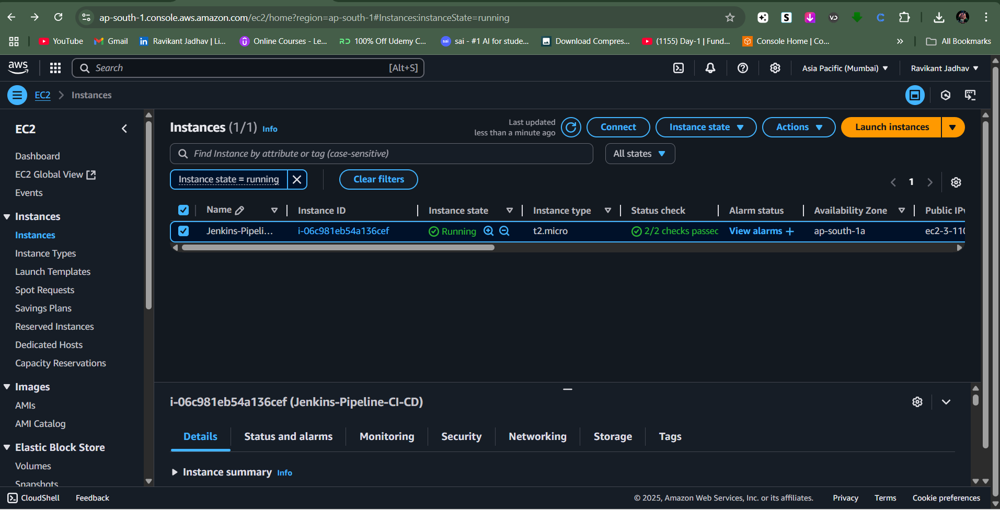
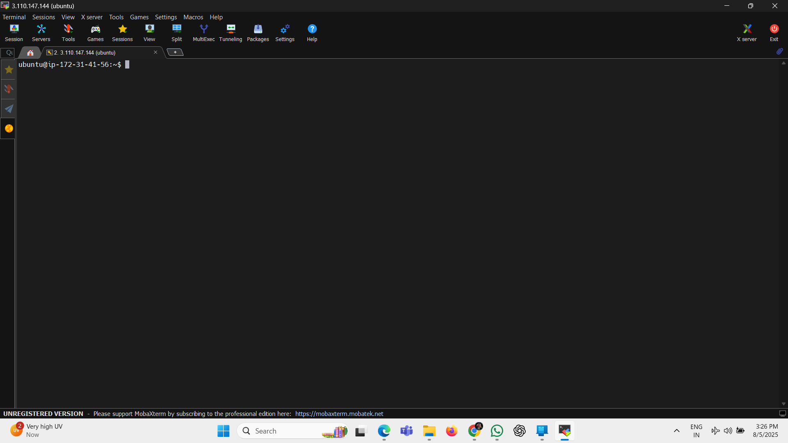
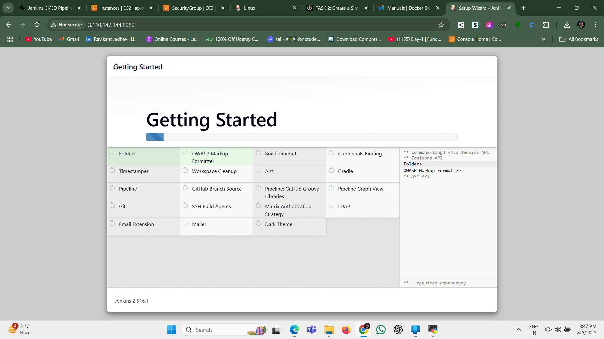
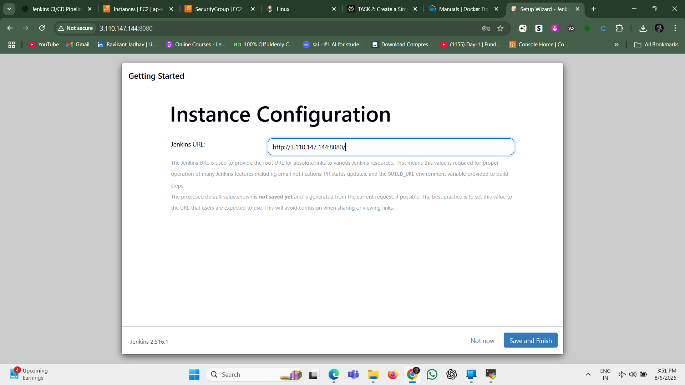
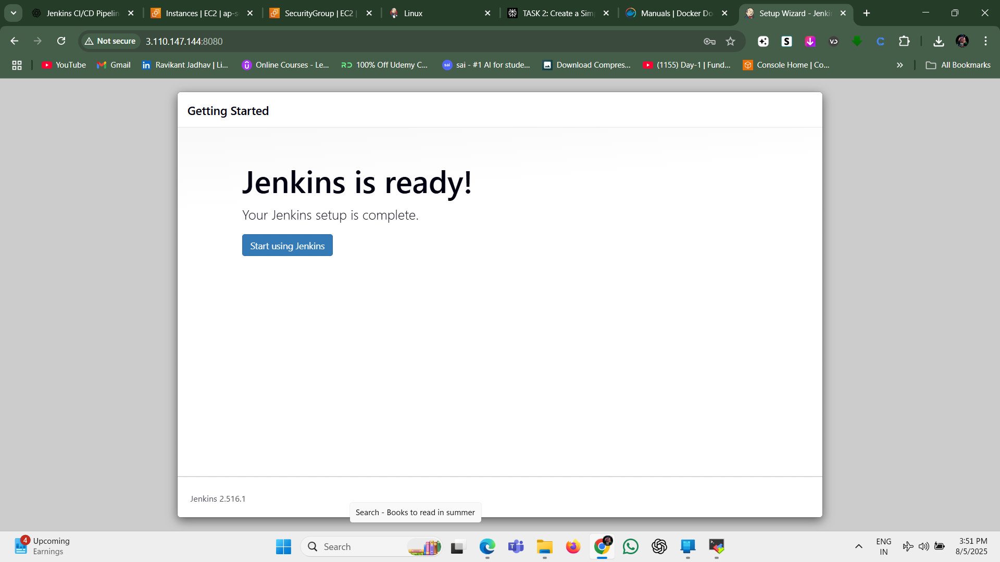
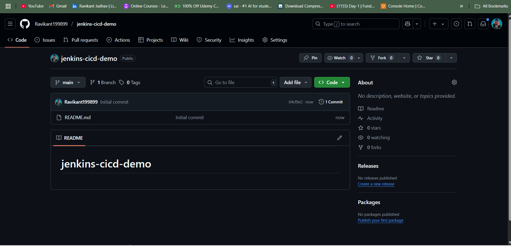
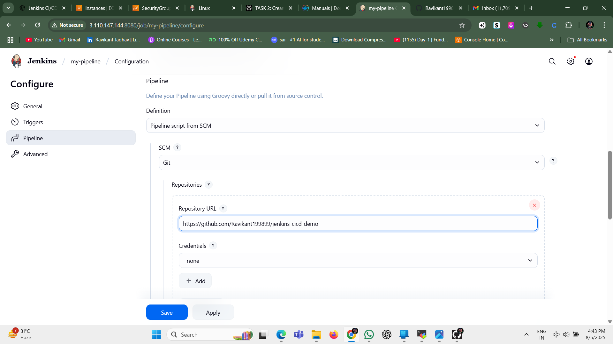
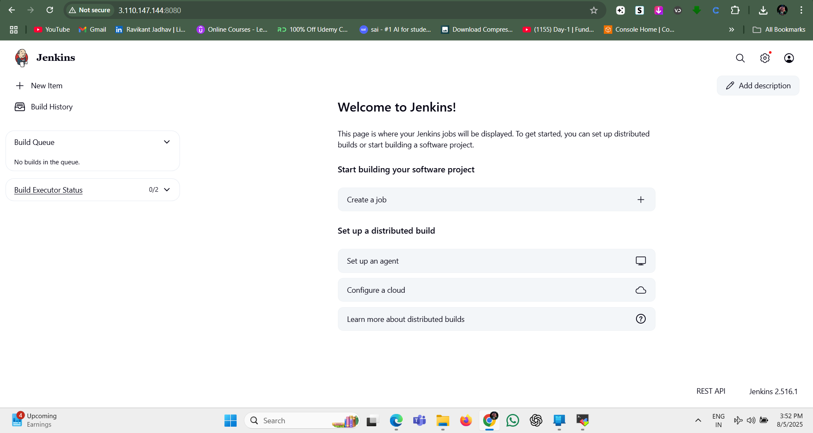
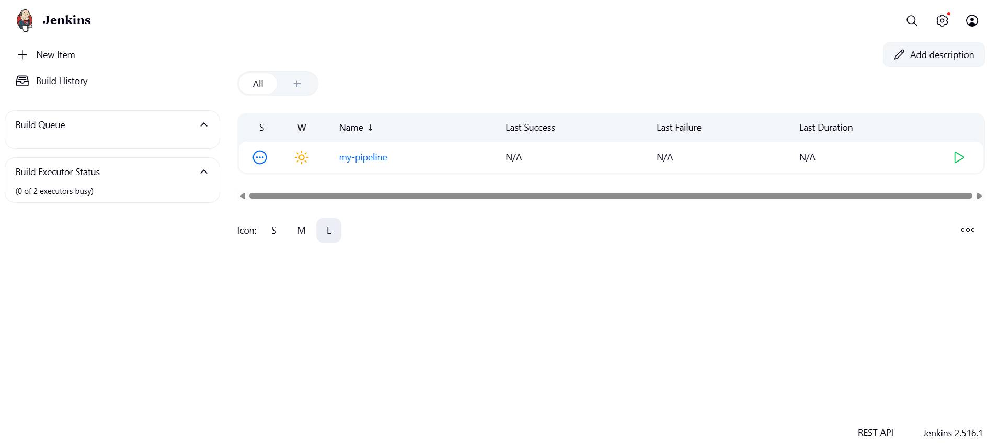
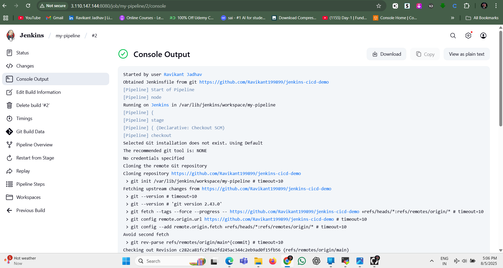

# Jenkins CI/CD Pipeline Demo

## Overview
This project demonstrates a simple **Jenkins + Docker CI/CD pipeline** integrated with **GitHub** and deployed on an **AWS EC2 Ubuntu instance**. The pipeline automates building, testing, and deploying a sample application whenever code changes are pushed to GitHub.

---

## Prerequisites
Before you start, ensure you have the following:
- An **AWS account** with an Ubuntu EC2 instance running.
- Jenkins installed on the EC2 instance.
- Docker installed on the EC2 instance.
- A **GitHub repository** containing your application code and Jenkinsfile.
- Basic knowledge of Git, Jenkins, and Docker.

---

## Setup Steps
Follow these steps to set up the CI/CD pipeline:

1. **Launch an Ubuntu EC2 instance on AWS.**  
     
   *(Screenshot of AWS EC2 instance running)*

2. **SSH into your EC2 instance.**  
     
   *(Terminal showing successful SSH connection)*

3. **Install Jenkins on the EC2 instance.**  
   - Added Jenkins repository key.  
   - Installed and started Jenkins service.  
     
     
     
     
     

4. **Install Docker and enable Jenkins to use Docker.**

5. **Create a GitHub repository** containing your `app.py` and `Jenkinsfile`.  
   

6. **Create a new Pipeline job in Jenkins, and configure it to use your GitHub repo.**  
     
     
   

7. **Configure GitHub webhook for automatic build triggers.**

8. **Verify the Jenkins Dashboard showing your job is ready.**  
     
   

9. **Trigger the pipeline manually or by pushing code and verify the build success.**  
   

---

## Pipeline Stages

- **Build:** Builds the application or Docker image.  
- **Test:** Runs tests on the built application/image.  
- **Deploy:** Deploys the application (e.g., runs the Docker container).

Each stage is automated by the Jenkins pipeline defined in the `Jenkinsfile`.

---

## How to Reproduce

1. Launch an AWS EC2 Ubuntu instance and SSH into it.
2. Install Jenkins and Docker.
3. Setup your GitHub repo with application code and a `Jenkinsfile`.
4. Create a Jenkins Pipeline job linked to your GitHub repo.
5. Configure webhook on GitHub to trigger Jenkins on commits.
6. Push code changes and observe Jenkins build and deploy automatically.

---

## Screenshots

| Step                  | Screenshot                                  |
|-----------------------|---------------------------------------------|
| EC2 Instance Running  |       |
| SSH Access            |          |
| Jenkins Installation  |              |
| GitHub Repo           |     |
| Jenkins Job Creation  |        |
| Jenkins Dashboard     |         |
| Successful Build      |         |

---

Thank you for exploring this Jenkins CI/CD pipeline demo!  
Feel free to reach out if you want to expand or customize this setup.

